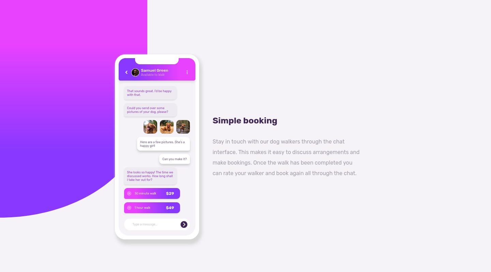
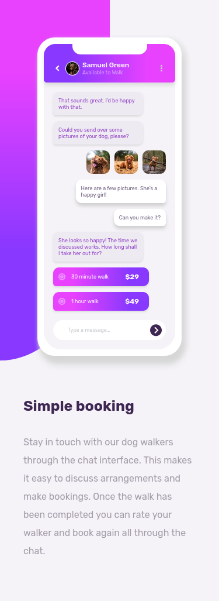

# Frontend Mentor - Chat app CSS illustration solution

This is a solution to the [Chat app CSS illustration challenge on Frontend Mentor](https://www.frontendmentor.io/challenges/chat-app-css-illustration-O5auMkFqY). Frontend Mentor challenges help you improve your coding skills by building realistic projects.

## Table of contents

- [Overview](#overview)
  - [The challenge](#the-challenge)
  - [Screenshot](#screenshot)
  - [Links](#links)
  - [Built with](#built-with)
- [Author](#author)

## Overview

### The challenge

Users should be able to:

- View the optimal layout for the component depending on their device's screen size
- **Bonus**: See the chat interface animate on the initial load

### Screenshot

#### Desktop View

#### Mobile View

### Links

- Solution URL: [https://github.com/darielmedr/chat-app-css-illustration-frontend-mentor](https://github.com/darielmedr/chat-app-css-illustration-frontend-mentor)
- Live Site URL: [https://darielmedr.github.io/chat-app-css-illustration-frontend-mentor/](https://darielmedr.github.io/chat-app-css-illustration-frontend-mentor/)

### Built with

- Semantic HTML5 markup
- SCSS custom properties
- Flexbox
- Mobile-first workflow
- [Boxicons](https://boxicons.com/) - Web Icons Set

## Author

- Frontend Mentor - [@darielmedr](https://www.frontendmentor.io/profile/darielmedr)
- GitHub - [@darielmedr](https://github.com/darielmedr)
- LinkedIn - [Dariel Medina Rodríguez](https://www.linkedin.com/in/darielmedr)